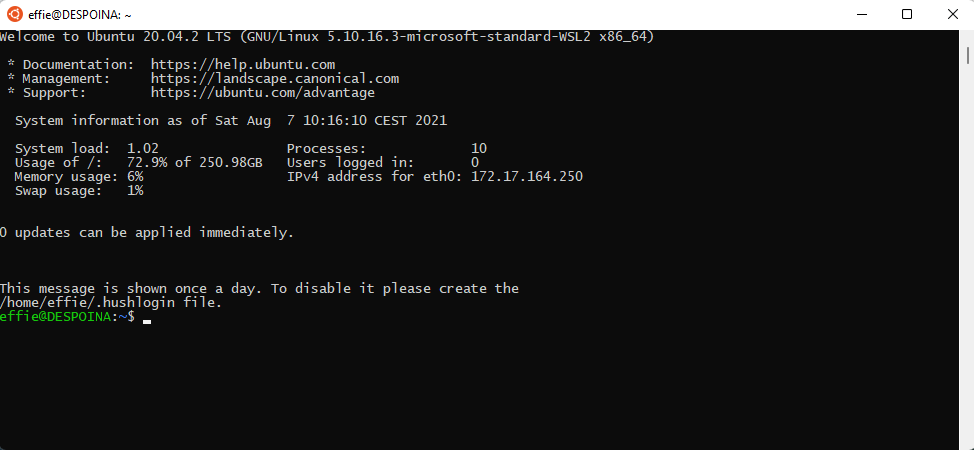

After the recent news about deprecating support of building AOSP on macOS, and hoping to not switch to Linux full-time for any kind of AOSP dev, I decided to give WSL2 a shot. Here it is!

#### What is WSL?

"The Windows Subsystem for Linux lets developers run a GNU/Linux environment -- including most command-line tools, utilities, and applications -- directly on Windows, unmodified, without the overhead of a traditional virtual machine or dualboot setup."
From- [https://docs.microsoft.com/en-us/windows/wsl/about](https://docs.microsoft.com/en-us/windows/wsl/about)

In short, it's like running Linux without committing your life to Linux and being able to stay in Windows for everything else. It can even run Android Studio in Linux! While most things work great, one of the few disadvantages are, that it cannot run the Android emulator directly because WSL2 itself uses virtualization technology - that part has to be done on the Windows side of the world. However, as we'll see, we can work around this with a bit of extra work.

#### What do you need to consider this strategy?

1. A Windows computer, easier if it's a Windows Insiders preview build but not required
2. More than 16GB of RAM - building AOSP itself requires 16GB of RAM, which means from a practical perspective that you need at least 20GB+
3. About 200GB of free disk space - AOSP is big! (this is what it took me, the internet said more so maybe depends on the image you plan on building). The max size of wsl hard disk is 256GB, if you need to expand it, the instructions to doing so are here [https://docs.microsoft.com/en-us/windows/wsl/compare-versions#expanding-the-size-of-your-wsl-2-virtual-hard-disk](https://docs.microsoft.com/en-us/windows/wsl/compare-versions#expanding-the-size-of-your-wsl-2-virtual-hard-disk)

#### How to install WSL?

The easiest way is to just run on command line

    wsl --install

This command only works if you have Windows Insiders preview builds of Windows 11.

The default command installs Ubuntu 20.04.2 LTS, but you can set a parameter for a different distribution of your choice. The AOSP documentation describes what to do using Ubuntu, so we'll go with that.

For the manual steps, in case you don't have Windows Insiders (that aren't complicated, there's just more steps), go to [https://docs.microsoft.com/en-us/windows/wsl/install-win10](https://docs.microsoft.com/en-us/windows/wsl/install-win10) and follow along.

Then running `wsl` (or, clicking open on the Ubuntu app from the store!) will run Ubuntu and prompt you to choose name & password and you're good to go!

#### Increasing WSL's available RAM

Running AOSP builds requires at least 16GB or RAM and WSL gets assigned by default usually about 8 (or half of the available RAM in your computer, whichever's the lowest!), so you might as well go ahead now and increase it as much as you can. Building AOSP with 8GB or RAM is impossible. With 12GB of RAM and `make -j2` to make it use less memory, the build ran in ~7 hours, but succeeded!

In order to give WSL more RAM (or less...), create a file in your Windows Home directory named `.wslconfig` (`%UserProfile%\.wslconfig`), with the text:

    [wsl2]
    memory=16GB

Reboot WSL for the changes to take effect - the easiest way to do this is via `wsl.exe --shutdown` and then reopen the shell.

### Setting up the linux environment to get and build AOSP

##### 1. I ran this command to be extra sure everything is updated

    sudo apt update && sudo apt full-upgrade -y

##### 2. From AOSP install instructions, install the dependencies

    sudo apt-get install git-core gnupg flex bison build-essential zip curl zlib1g-dev gcc-multilib g++-multilib libc6-dev-i386 libncurses5-dev lib32ncurses5-dev x11proto-core-dev libx11-dev lib32z1-dev libgl1-mesa-dev libxml2-utils xsltproc unzip fontconfig

##### 3. Set up the correct python

Repo wants Python 3.x, and Python people can tell you more about why it's a little bit of a mess, but this command fixed it so that repo was happy

    ## Ensure that the `python` command points to python 3.8, not python 2.x
    sudo apt install python-is-python3

#### Downloading AOSP

For the next steps to download and make AOSP you can follow the official guide, you're now on Linux! Enjoy!
[https://source.android.com/setup/build/downloading](https://source.android.com/setup/build/downloading)

Coming up next - Running and debugging the created system image!
