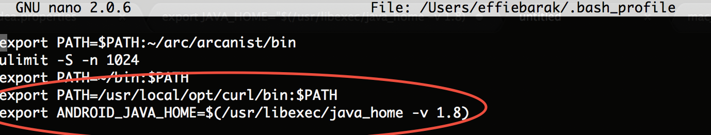
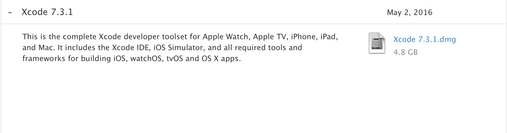
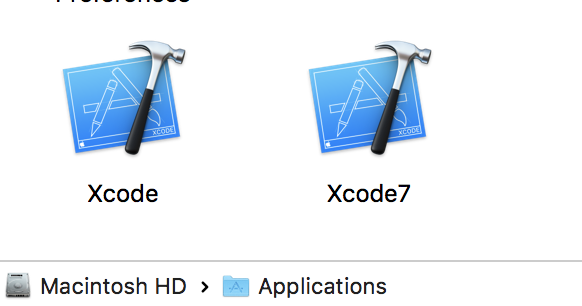

In this post, I'm going to continue with how to build and open AOSP - [Part 1](http://effie.io/installing-aosp-on-a-mac-part-1/) covered how to download the respository, and this part is how to build it so that you end up with an image that can be deployed via [fastboot](https://android.gadgethacks.com/how-to/know-your-android-tools-what-is-fastboot-do-you-use-it-0155640)

Part 3 (coming up) will be all about opening the project up in IntelliJ so that IDE features such as 'Go to Definition' work correctly.

### 1. Add environment variables to .bash_profile

- Open bash_profile by typing

  nano ~/.bash_profile

* Add this line to it:

`export ANDROID_JAVA_HOME=$(/usr/libexec/java_home -v 1.8)`

-

Save (by clicking ^O and enter to confirm the file name) and Exit (^X)

-

Now either close and reopen your terminal, or load your new profile to the current terminal by running:

    . ~/.bash_profile

### 2. Install curl with OpenSSL

This is needed for the jack-server to run - AOSP seems to need a version of curl specifically built against OpenSSL whereas curl built into macOS uses the Mac APIs for TLS support.

- Install curl:

  brew install curl --with-openssl

* Open bash_profile by typing:

  nano ~/.bash_profile

- Add this line to it:

`export PATH=/usr/local/opt/curl/bin:$PATH`

- Export bash profile to the current terminal by running

  . ~/.bash_profile

(or open and close the terminal)

- Your bash profile file should looks similar to:

### 3. Install older Xcode

This part is only needed if you're building Android lower than Android O on macOS >= Sierra

-

Go to [Apple Developer website](https://developer.apple.com) (or anywhere else you could find older versions of Xcode)

-

Download any Xcode in the range of SDKs 10.8 10.9 10.10 10.11 (for example, Xcode 7.3.1

-

Install it side- by- side to your current Xcode: Copy it to Application and choose "keep both", you can later rename the new version of Xcode to something easy such as "Xcode7"

-

Switch to the older Xcode for building AOSP by running

    sudo xcode-select --switch /Applications/Xcode7.app

### 4. Make AOSP

- Navigate to the Android AOSP root directory:

  cd /Volumes/AOSP/android

* Dot-source the script into your current shell to set up the environment

  . build/envsetup.sh

- Choose and set the build target, a list of all possible variables can be found at [AOSP website](https://source.android.com/source/running#selecting-device-build), for example this target is emulator, with all debugging enabled

  lunch aosp_arm-eng

* Run the build (caffeinate is for the process to stay awake)

  caffeinate make -j4

- Wait ~40 minutes or so :)

**Notes about my process**

1.

J`X` where `X` is the number of processes running concurrently, you can increase / decrease this number but a good number is 2x the number of CPUs in your computer (-j4 for an i5-based machine and -j8 for an i7-based machine).

2.

Ninja is an incremental build, if it's interrupted, it'll just pick on where it left off so don't worry about cancelling mid-way
