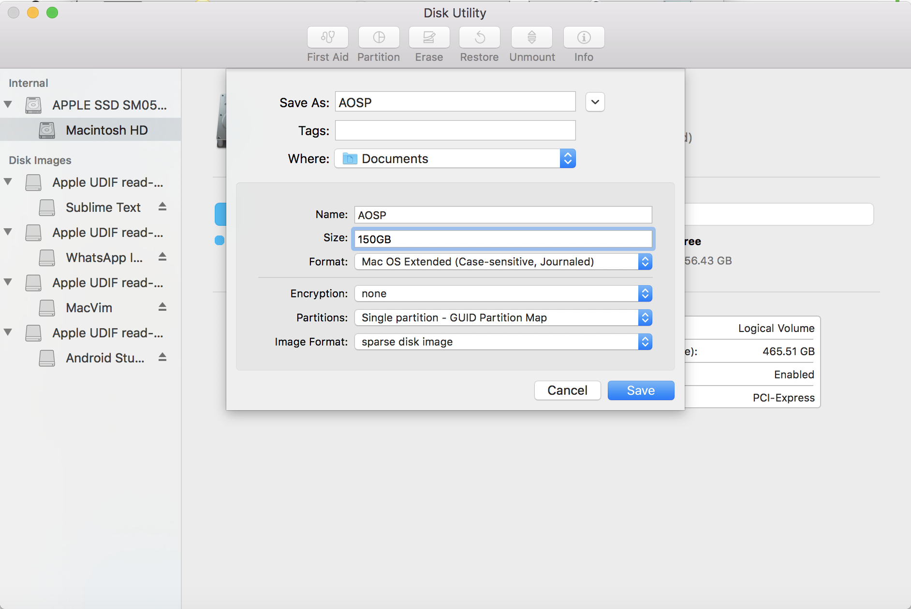
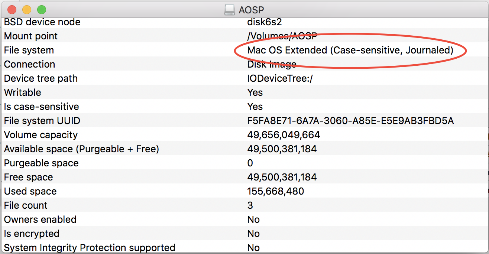
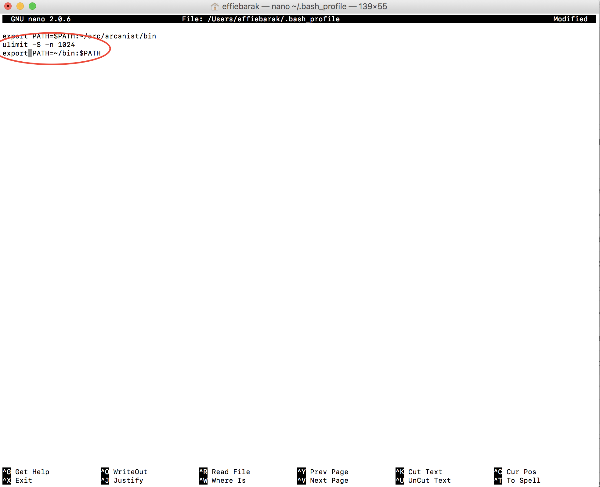

In this post, I'm going to go into the details of how to download and install AOSP on a modern macOS machine. The instructions on the [official Android page](https://source.android.com/source/initializing) are somewhat out-of-date, and aren't as well-maintained as the Linux instructions.

### 1. Create a case-sensitive disk image:

Because Android requires a case-sensitive filesystem, we need to create a separate drive.

This was easy-peasy using the Disk Utility tool, the important thing here is that it **must** be case sensitive or nothing will build:

1. Open Disk Utility
2. Hit File -> New Image
3. Name it and decide where you want it to live
4. Choose the format “Mac OS Extended (**Case- Sensitive**, Journaled)
5. Choose the image format “sparse disk image”
6. Choose the size (I put 150GB here). **Make sure if you change other settings that this setting doesn’t reset back to the default 100MB.**
7. Hit “Save”

After it’s done creating (should be super fast for a sparse image), verify that the new drive is indeed case-sensitive by hitting “info” on it

If it's not (I had a bug in my old Mac and it kept creating a non case-sensitive image), run this command:

    # hdiutil create -type SPARSE -fs 'Case-sensitive Journaled HFS+' -size 150g ~/AOSP.dmg

**Notes about my process**

1. I used the Disk Utility UI tool. It seems to work just great! My old computer for some reason didn’t agree to create a case- sensitive image, but my new Mac running Sierra 10.12.3 seems to completely agree to this
2. The official docs say to allocate 40GB, but that's like… KitKat? When I tried 100GB it threw up from lack of space in the middle of building, so I went with 150GB. The final size after compiling is around 80GB but it’s possible that a sparse image is even more wasteful or that there are things created during build that are later cleaned up.

### 2. Install the JDK:

- Install XCode command line tools:

  xcode-select --install

* Install Homebrew by running:

  ruby -e "\$(curl -fsSL https://raw.githubusercontent.com/Homebrew/install/master/install)"

- Install these packages from Homebrew:

  brew install automake  
   brew install sdl  
   brew install git  
   brew install gnupg

* Set the file descriptor limit:

Open bash_profile by typing

    nano ~/.bash_profile

And add these two lines to it:
`ulimit -S -n 1024`

`export PATH=~/bin:$PATH`

_(the second line is for later but might as well)_

Your file should have these lines added so it would look something like this:

Save (by clicking ^O and enter to confirm the file name) and Exit (^X)

**Notes about my process**

I chose Homebrew to install / install packages from instead of MacPorts and switched the packages names accordingly, if you prefer MacPorts (or care), see the original instructions.

### 3. Download the Source:

- Install the repo by running

  mkdir ~/bin  
   curl https://storage.googleapis.com/git-repo-downloads/repo > ~/bin/repo  
   chmod a+x ~/bin/repo

* Initialize a Repo client
  Navigate into the AOSP drive

      cd /Volumes/AOSP

- Make a directory for the code and go into it

  mkdir android  
   cd android

* Configure your user name and email (it has to be an email address that is connected with a registered Google account)

  git config --global user.name "Your Name"  
   git config --global user.email "you@example.com"

- Initialize the repo

  repo init -u https://android.googlesource.com/platform/manifest

* Choose which version of Android you want to sync (in my example, this is Nougat for Nexus 5X, Nexus 6P, Pixel XL, Pixel, Pixel C, a complete list can be found [on the builds list](https://source.android.com/source/build-numbers#source-code-tags-and-builds)

  repo init -u https://android.googlesource.com/platform/manifest -b android-7.1.2_r8

- Sync the repo

  repo sync

## Part 1 completed!

Great news, now all you have to do is wait ~30-60 minutes for the sync to complete, and you'll have a local copy of AOSP!
