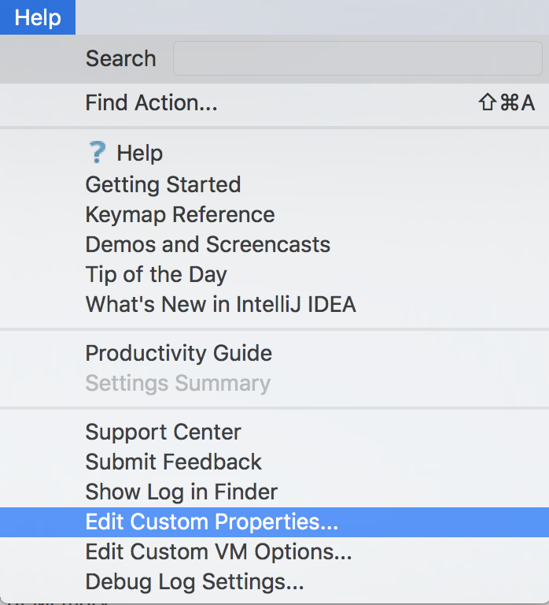
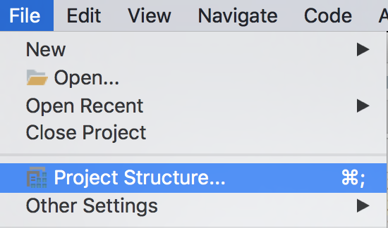
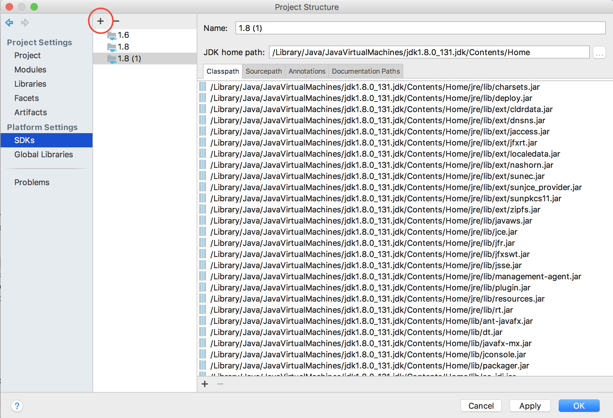
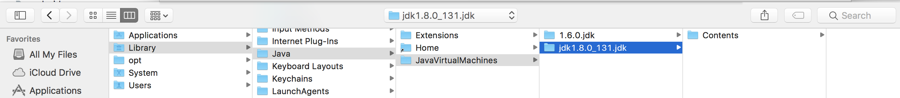
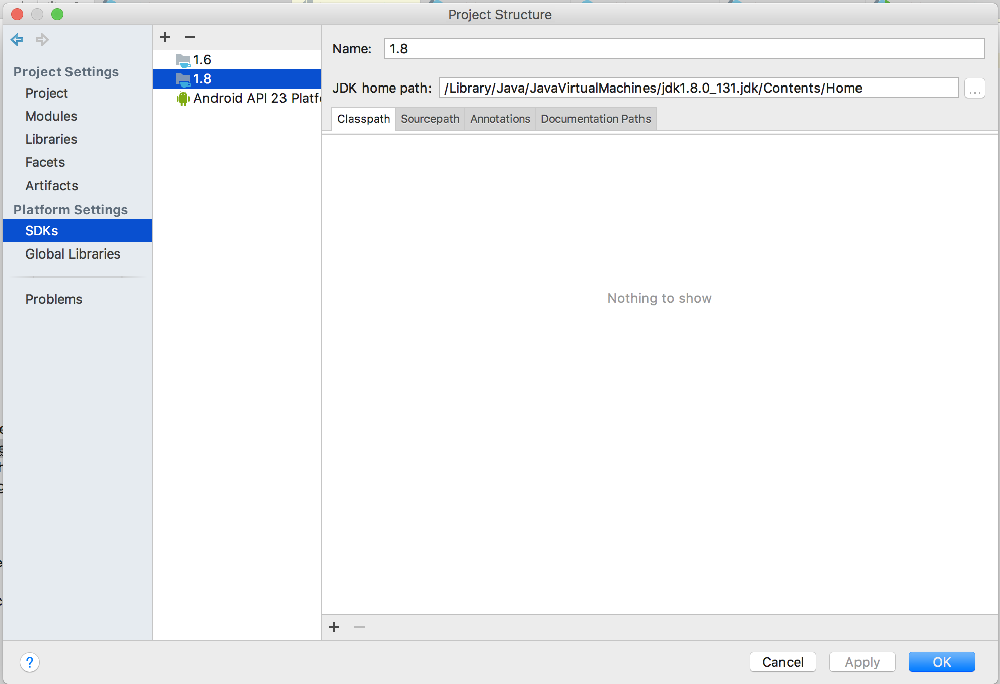
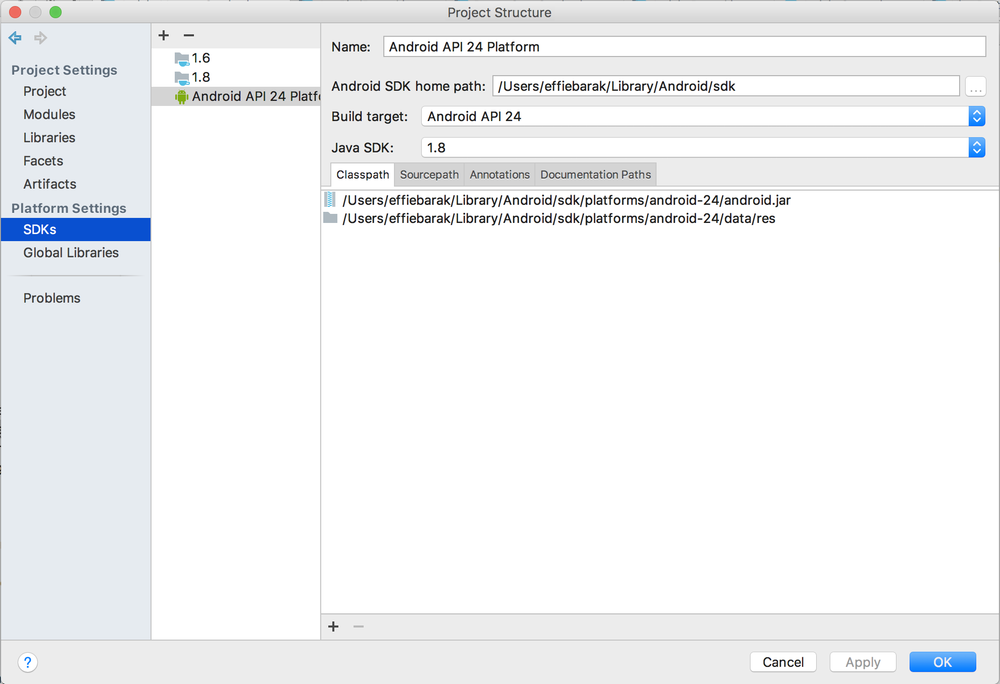
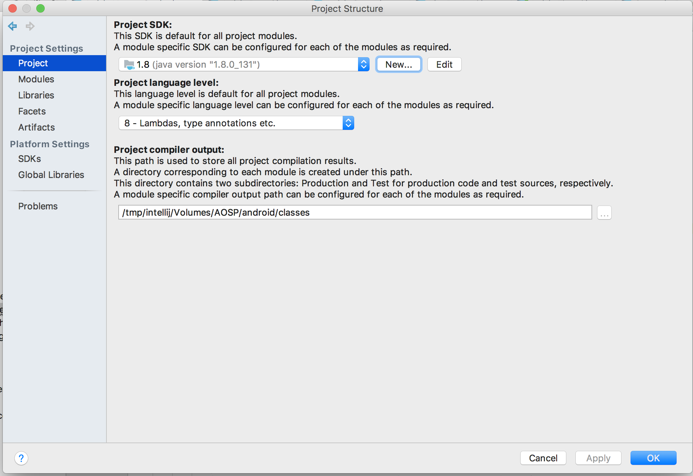
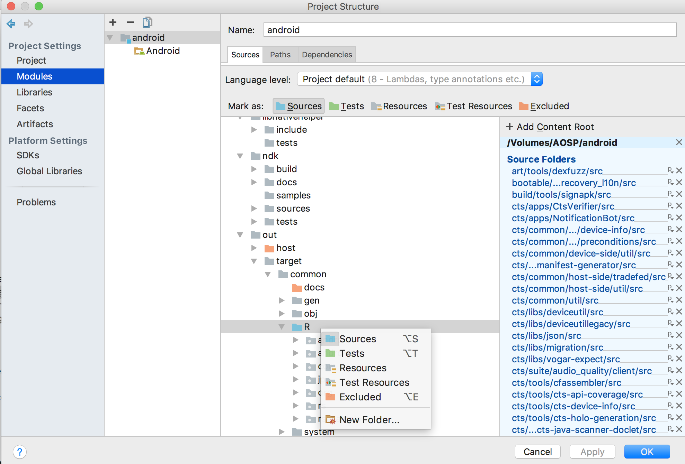
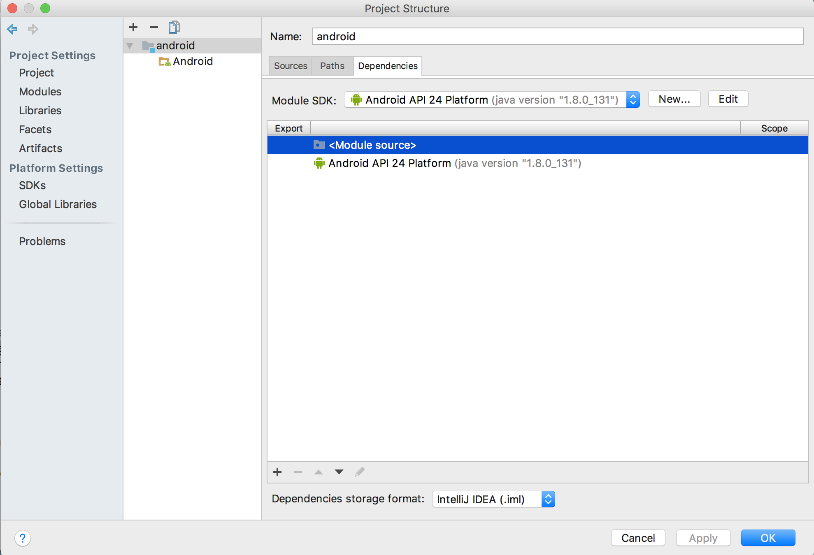

In this post, I'm going to continue with how to open AOSP and get IntelliJ support, [Part 2](http://effie.io/building-aosp-part-2/) covered how to build AOSP, this part is how to open it in IntelliJ so you can navigate the codebase using a familiar editor similar to how you write apps.

I tried getting the project to open with Android Studio as well, and got pretty close to the same result I did with IntelliJ, but ultimately IntelliJ provided better environment support than AS.

## The Basics

These are the very minimum steps you'll have to go through in order to get basic support from the IDE (i.e to not see a page full of red lines and get basic navigation to/from classes).

- Install IntelliJ (I installed the Community Edition)
- Run the scripts that generate the IDE information

  source build/envsetup.sh && mmma development/tools/idegen -j32  
   development/tools/idegen/idegen.sh

* Open the generated android.ipr with IntelliJ and wait ~20 minutes for indexing to complete.

## Extra Tweaks

These adjustments will make even more errors and red lines go away and will result in way friendlier coding environment.

### Setting up IntelliJ to parse big files

- Open IntelliJ
-

Go to Help -> Edit Custom properties. Create the file if prompted to do so.

-

Copy these lines into the file and save the file:

    # custom IntelliJ IDEA properties
    idea.max.intellisense.filesize=500000
    idea.case.sensitive.fs=true

- Go to Help -> Edit custom VM properties. Copy these lines into the file and save the file:

  # custom IntelliJ IDEA VM options

  -Xms1024m
  -Xmx4096m
  -XX:ReservedCodeCacheSize=240m
  -XX:+UseCompressedOops

### Setting up the jdk and enviroment variables

This is to help with basic language intellisense, and to eliminate resources not identified errors.

- Go to File -> Project Structure

- Go to SDKs, and hit +, add JDK, choose JDK 1.8.0

- Remove all the jars from the list in the 'Classpath' tab.

-

Add an Android API level 24 or 25 (for N)

-

Go to 'Project' and select this SDK in 'Project SDK'

- Set 'Project language level' to 8

- Go to the Modules tab, and in Sources tab navigate to out/target/common/R folder. Right click on it and click Source. Apply.

- In the same Modules tab open Dependencies tab, remove all the dependencies, and choose the Android SDK as the module SDK.

- Invalidate the cache and restart

### Creating a fake manifest file

This is to help with the errors of "this API is only available above a certain SDK level"

- In the main android directory, create an AndroidMainfest.xml file
- Add this content to it:

    <?xml version="1.0" encoding="utf-8"?>
    <manifest xmlns:android="http://schemas.android.com/apk/res/android">  
      <uses-sdk android:minSdkVersion="24" />
    </manifest>

_These are the basic stuff I did, there are probably many more tweaks possible to this process (for example, there could be other other resource directories not marked as such) so play around until you reach an acceptable level._
