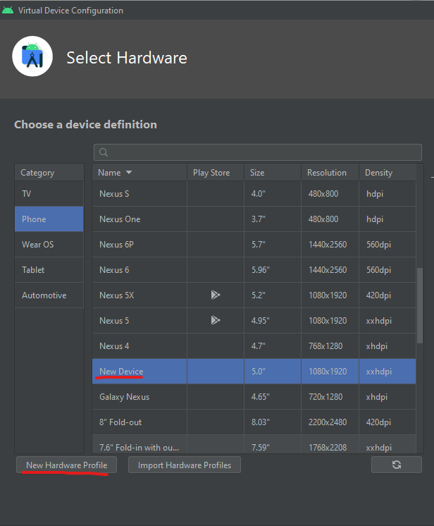
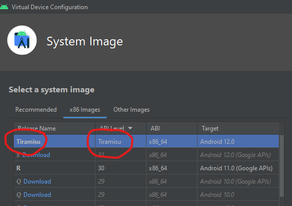
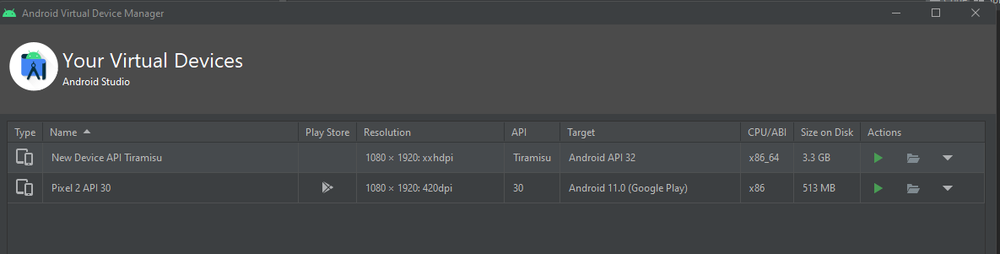
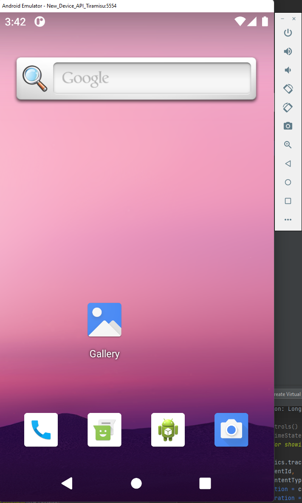

Part 2 of this post is what to do with the created images from my AOSP build and how to run them on the Windows emulator.

#### Adding disk space to WSL

Now, while doing this, or later, you'll run out of disk space with AOSP, so instead of waiting for a build to fail, do yourself a favor and increase the size to 300GB+ now, follow these instructions to do it:
[https://docs.microsoft.com/en-us/windows/wsl/compare-versions#expanding-the-size-of-your-wsl-2-virtual-hard-disk](https://docs.microsoft.com/en-us/windows/wsl/compare-versions#expanding-the-size-of-your-wsl-2-virtual-hard-disk)

#### Make sure you're building AOSP for the Windows emulator.

Instead of the default lunch, change lunch to a Windows compatible generic emulator build

    lunch aosp_x86-eng

Then run `m` as usual

#### Make the SDK/ zip files with the image files

In order to make image files that can be moved out/ used by "other computers" (the windows emulator), run

    make -j8 sdk sdk_repo

This command refused to work on my old computer, dying every time from lack of resources, but passed fine when I got a new computer and gave wsl 20GB of RAM, happy compiler!

When this pass, you'll end up with some zip files in your `\\wsl.localhost\Ubuntu\home\<user>\<aosp_dir>\out\host\linux-x86\sdk\sdk_phone_x86_64` (you can see them with windows file explorer)

Grab `sdk-repo-linux-system-images-eng.<user>.zip` and copy it into somewhere Window'sy

#### Add the image files to Windows Android SDK

Now remember we can't actually run the emulator on WSL, so we need these files to be able to be used by AVD on Windows, so create a folder tree under the installed Android Studio SDK folder **in Windows** (it would be in `<User>/AppData/Local/Android/sdk`)

Complete manually (create folders) the tree parts that are missing:
`system-images/android-<pick dev version, currently 31>/google-apis`
Then extract the contents of the zip file into this last folder

#### Create an AVD

Go to AVD, and create a virtual device, then click "New Hardware profile" at the bottom and the defaults are fine.

Find the system image in the list, and select it.

And there it is! Ready to run!

